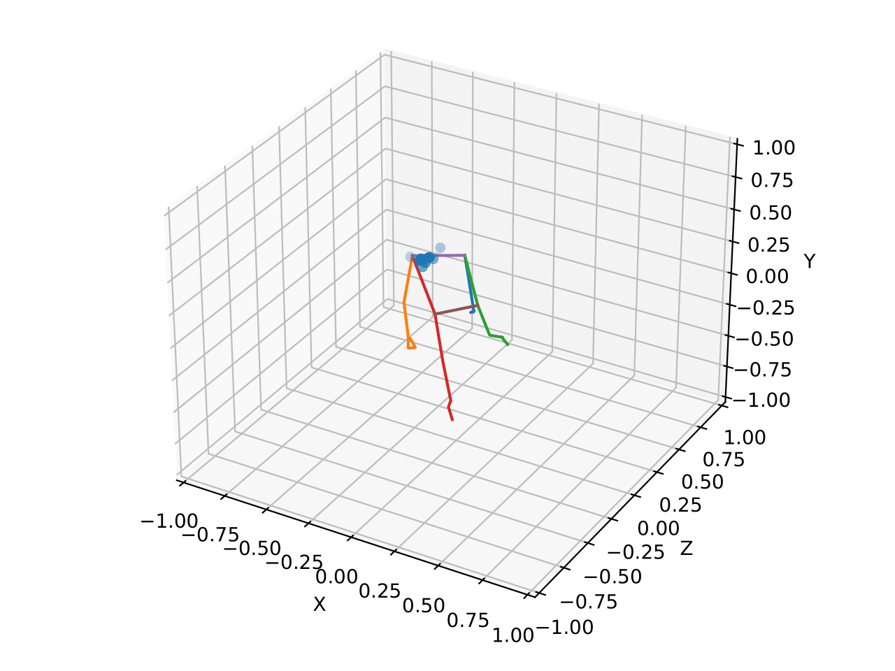

# 
ポートフォリオ

## 目次
- [自己紹介](#自己紹介)
- [研究内容](#研究内容)
- [技術スキル](#技術スキル)
- [プロジェクト一覧](#プロジェクト一覧)
- [趣味](#趣味)
- [連絡先](#連絡先)

---

## 自己紹介
大学院ではVR技術を活用したリハビリテーションシステムの研究開発に取り組んでいます。  
研究外ではLLMや機械学習、電子工作など自主的に取り組んでいます。  
https://github.com/cappuccino3044vaps

  

スキルチャート（クリックして展開）

| スキル        | レベル    |
|:-------------:|:---------:|
| Unity         | ⭐⭐⭐⭐⭐   |
| Python        | ⭐⭐⭐⭐    |
| 信号処理       | ⭐⭐⭐⭐    |
| 機械学習       | ⭐⭐⭐     |
| RaspberryPi   | ⭐⭐      |

---

## 研究内容

### VRリハビリテーションシステム
> 姿勢推定モデルを使って関節座標を取得し、解析を行っています。これにより、リハビリテーションの効果を定量的に評価できるシステムの開発を進めています。

  

    

      
      
<b>手指トラッキング技術</b>

    

    

      
      
<b>3次元姿勢推定</b>

    

  

### VR開発環境
VRシステムは Unity を使用して実装しています。患者さんが楽しみながらリハビリに取り組める環境の構築を目指しています。

  

    
    
  

### 脳血流計測実験

  
  
<i>VRゴーグルと脳血流計測キャップを併用した実験風景</i>

取得した脳血流データに信号処理を施して、統計的な検定を行います。主に MATLAB を使用しています。

  
  
<i>脳活動の統計解析マップ</i>

---

## 技術スキル

  

    

      <h3>信号処理</h3>
      
生体信号などのノイズを含む時系列データに対して、カルマンフィルタなどの手法を用いた信号処理技術を学んでいます。

      
    

    

      <h3>IoT開発</h3>
      
RaspberryPi を使った電子工作にも取り組んでいます。

      
    

  

## 趣味

  
ゲーム・読書・ピアノ演奏・将棋・料理/お菓子作り・アウトドア活動（キャンプ・釣り・天体観測）

  

---

## 連絡先

